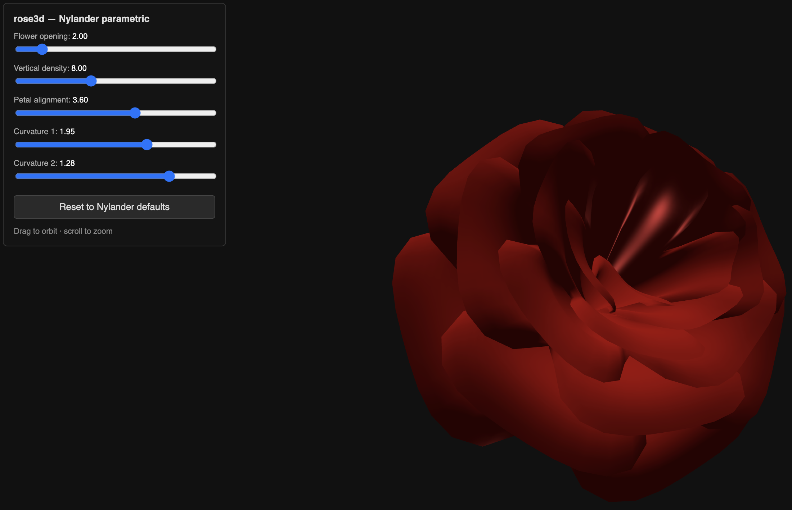

# rose3d

Interactive 3D rose viewer — Paul Nylander's parametric rose surface
([bugman123.com](http://bugman123.com/Math/Rose.lsp), 2009) with live sliders.

https://github.com/user-attachments/assets/16365ea6-c78e-4728-b051-a107736fc904

## Run

Open `index.html` in any modern browser. No build step.

## Controls

- Drag to orbit, scroll to zoom
- Five sliders: flower opening, vertical density, petal alignment, curvature 1, curvature 2
- Reset button restores Nylander's defaults

## Credit

Slider design and p5.js scaffolding adapted from
[Creativeguru97 / 3DMathDoubleFlowers part 2](https://github.com/Creativeguru97/YouTube_tutorial/blob/master/Play_with_geometry/3DMathDoubleFlowers/part2/sketch.js).
